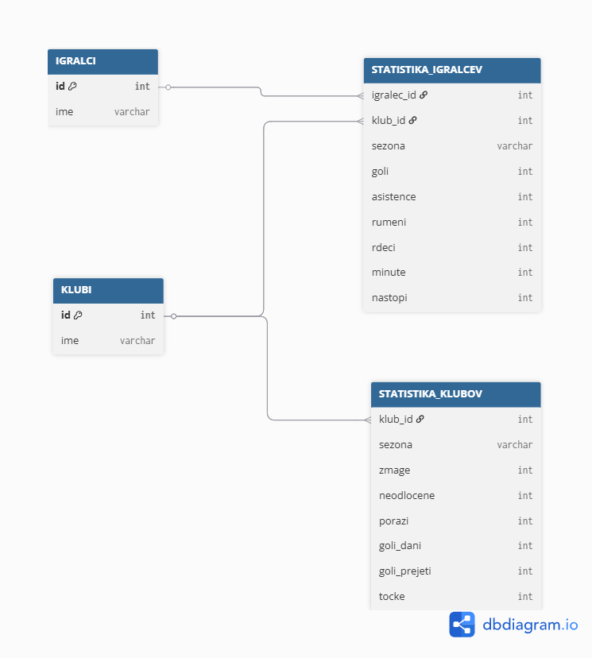

# PB1-Seminarska-Naloga

## Namen seminarske naloge
Namen seminarske naloge je zasnova programa za spremljanje statistike nogometne lige. Program omogoča shranjevanje podatkov o klubih, igralcih ter njihovih sezonskih statističnih dosežkih.

## Funkcionalnosti
- shranjevanje igralcev in klubov
- spremljanje statistike igralcev po sezonah in klubih
- spremljanje statistike klubov po sezonah
- izvajanje poizvedb (lestvice, statistični vodilni ipd.)

## ER Diagram

## Struktura baze
Baza vsebuje 4 tabele:

**klubi**  
- id
- ime

**igralci**  
- id
- ime

**statistika_igralcev**  
- igralec_id
- klub_id
- sezona
- goli
- asistence
- rumeni
- rdeci
- minute
- nastopi

**statistika_klubov**  
- klub_id
- sezona
- zmage
- neodlocene
- porazi
- goli_dani
- goli_prejeti
- tocke  

## Potrebni paketi (pip install bottle requests beautifulsoup4)
- bottle
- requests
- beautifulsoup4

## Navodila za zagon
- Za tekstovni vmesnik:
  - v mapi s projektom poženi "py cli.py"
- Za spletni vmesnik: 
  - V mapi s projektom poženi "py spletni_vmesnik.py"
  - V brskalniku odpri http://localhost:8080/
